# Vue-Homework

这里存放的是我学习VueJs课程所写的Vue前端项目，有Vue2和Vue3的版本。

「不定期更新」

[TOC]

## 一、ES6

### （一）闰年判断

#### 1. 实验目的与要求

（1）掌握ES6 let的使用；

（2）掌握if语句的使用；

（3）掌握input和 button标签的使用。

#### 2. 实验题目

创建一个HTML文件，在里面增加一个input标签和button标签。

要求：在input标签内输入年份，并点击button标签。在控制台（console）内会判断并显示输入的年份是否是闰年。

提示：可以被400整除的年份是闰年，或者能被4整除但同时不能被100整除的也是闰年。上面2个情况有一个正确即为闰年。

效果如下：

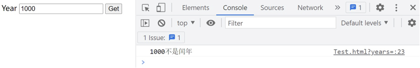

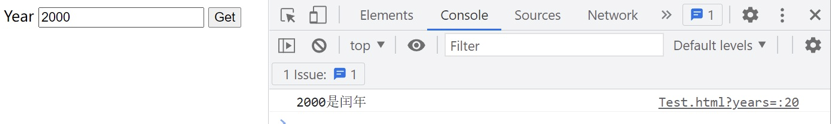

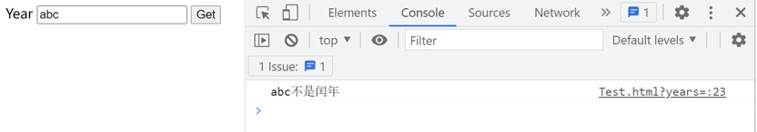

#### 3. 实验源码

[Vue2](./Vue2/ep2-1.html)  |  [Vue3](./Vue3/ep2-1/)

------

### （二）Button点击

#### 1. 实验目的与要求

（1）掌握ES6 let的使用；

（2）掌握for语句的使用；

（3）掌握button标签的使用。

#### 2. 实验题目

创建一个HTML文件，在里面增加5个button标签其名字分别为btn1、btn2、btn3、btn4、btn5。

要求：用for语句给5个button分别增加一个点击的事件函数。点击不同的button标签，在控制台内（console）显示出各个button的名字。

效果如下：

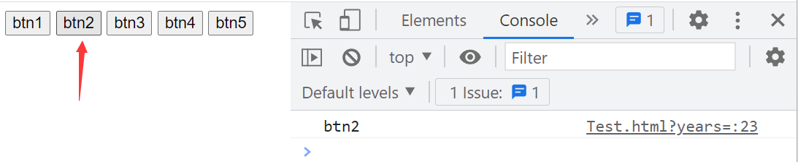

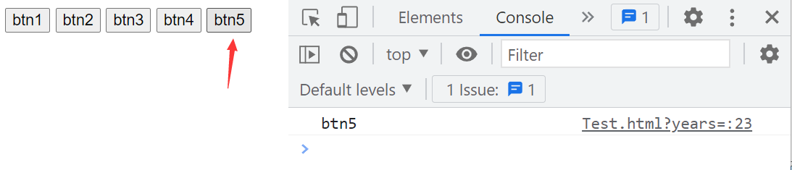

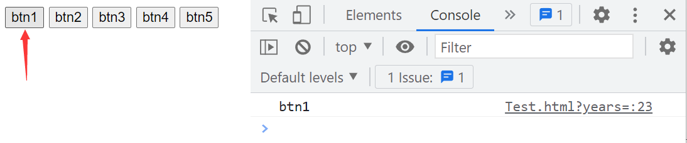

#### 3. 实验源码

[Vue2](./Vue2/ep2-2.html)  |  [Vue3](./Vue3/ep2-2/)

------

## 二、Vue 模版语法

### （一）VUE表单

#### 1. 实验目的与要求

（1）掌握Vue插值语法的使用；

（2）掌握Vue数据绑定。

#### 2. 实验题目

创建一个HTML文件，在body中增加一个form表单。表单中需要有姓名、性别和学龄信息，其中姓名是文本类型，性别是单选框，学龄是下拉菜单.

要求：

（1）姓名、性别、学龄为双项绑定。信息（information）显示为插值语法。

（2）信息（information）的值要随着姓名、性别、学龄的改变而自动改变。

效果如下 ：

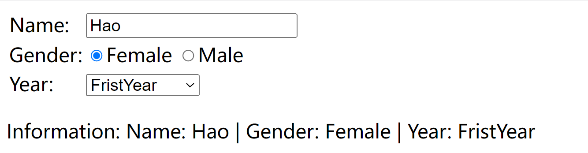

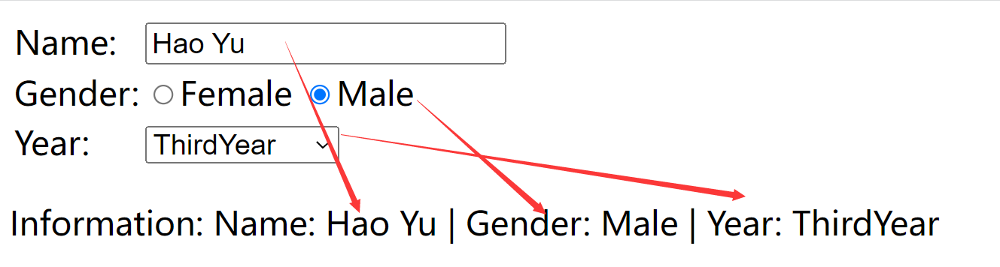

#### 3. 实验源码

[Vue2](./Vue2/ep4.html)  |  [Vue3](./Vue3/ep4/)

------

## 三、指令

### （一）购物清单

#### 1. 实验目的与要求

（1）掌握Vue条件渲染v-if的用法；

（2）掌握Vue列表渲染v-for的用法；

（3）掌握Vue自定义指令的用法。 

#### 2. 实验题目

创建一个HTML文件，在body中增加一些信息。比如购物清单、付款方式。

要求：

（1）购物清单的物品需要用列表渲染。

（2）付款方式需要有信用卡支付和手机银行2种情况，并可以用切换支付模式按钮切换。

（3）用自定义组件完成：点击切换支付模式按钮自动在输入框中聚焦。

效果如下: 

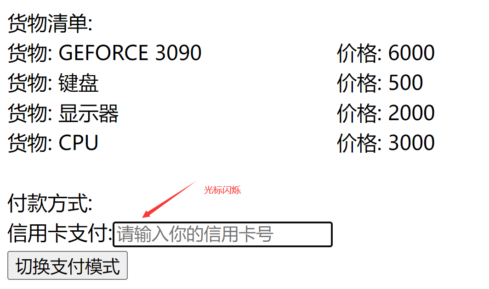

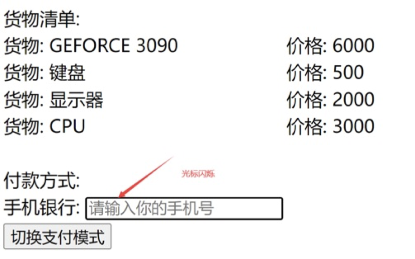


#### 3. 实验源码

[Vue2](./Vue2/ep6.html)  |  [Vue3](./Vue3/ep6/)

------

## 四、class与style绑定

### （一）阅读网页

#### 1. 实验目的与要求

（1）掌握Vue class绑定的用法；

（2）掌握Vue style绑定的用法。

#### 2. 实验题目

设计一个阅读网页。

 要求：

（1）需要4个按钮，分别控制：字体增大、字体缩小、夜间模式、边框模式。

（2）字体增大和缩小是用style绑定，且每点击一次字体就会逐渐变大或缩小。

（3）夜间模式、边框模式使用class绑定。

数据：选取Vue官网

操作元素的class列表和内联样式是数据绑定的一个常见需求。因为它们都是 attribute，所以我们可以用v-bind处理它们：只需要通过表达式计算出字符串结果即可。不过，字符串拼接麻烦且易错。因此，在将v-bind用于class和style时，Vue.js做了专门的增强。表达式结果的类型除了字符串之外，还可以是对象或数组。 

效果如下:

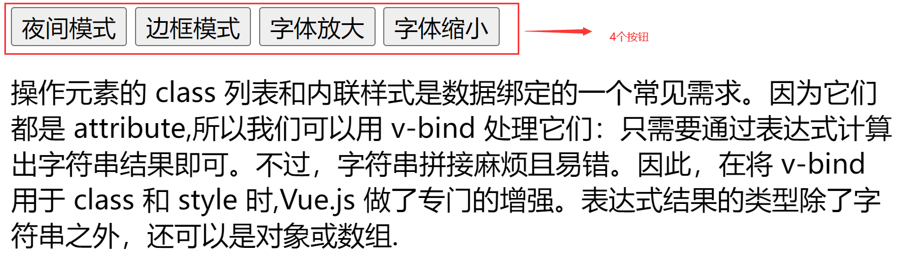

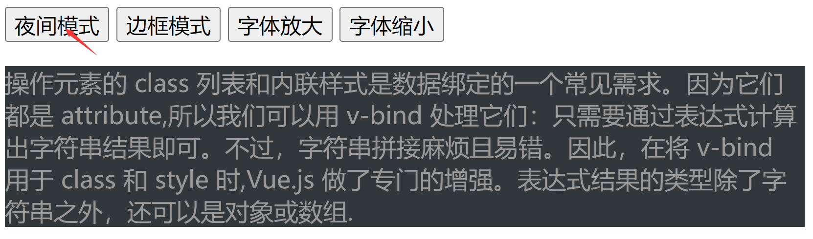

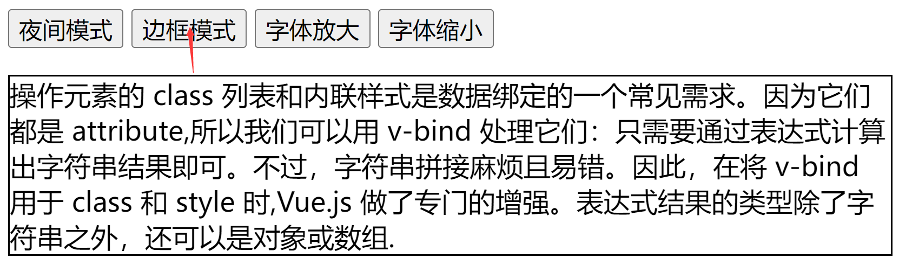

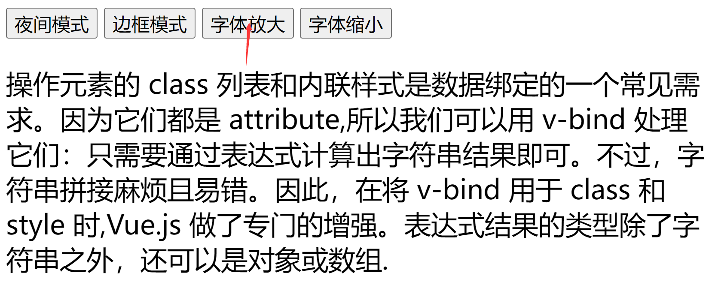

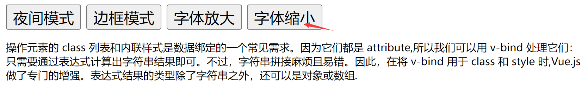

#### 3. 实验源码

[Vue2](./Vue2/ep8.html)  |  [Vue3](./Vue3/ep8/) 

------

## 五、生命周期

### （一）股票价格-生命周期加强版

#### 1. 实验目的与要求

（1）掌握Vue class或 style绑定的用法；

（2）掌握Vue watch的使用；

（3）掌握Vue的生命周期。

#### 2. 实验题目

设计一个股票网站。

要求：

（1）显示最新的股票价格，显示上次的股票价格，显示股票价格的变化（股票价格在0-100内的整数）。

（2）进入页面后，股票的价格自动每1秒随机变化一次（不需要按任何键）。

（3）当股票涨了，用红色显示涨了多少钱。

（4）当股票跌了，用绿色显示跌了多少钱。

（5）用watch来监听股票的价格变化。

（6）设计一个按钮销毁Vue的实例对象, 并在销毁前停止股票的定时器函数同时在控制台中显示已销毁。

提示：

股票随机数可以组合用`Math.floor() `向下取整 和` Math.random() `取0-1之间的随机小数来得到。

每隔几秒做什么，可以用`setInterval()`

```js
setInterval(()=>{

},2000)

// 新提示：取消定时器函数 clearInterval

// 例如

const i = setInterval(()=>{

},2000)

clearInterval(i);
```

效果如下:

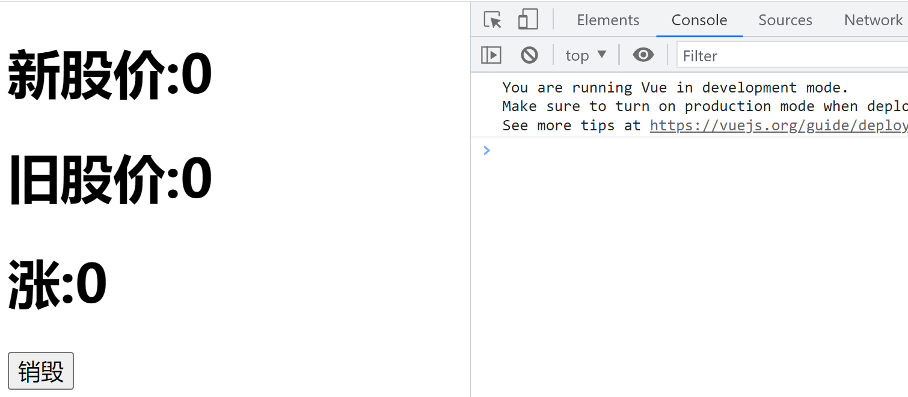

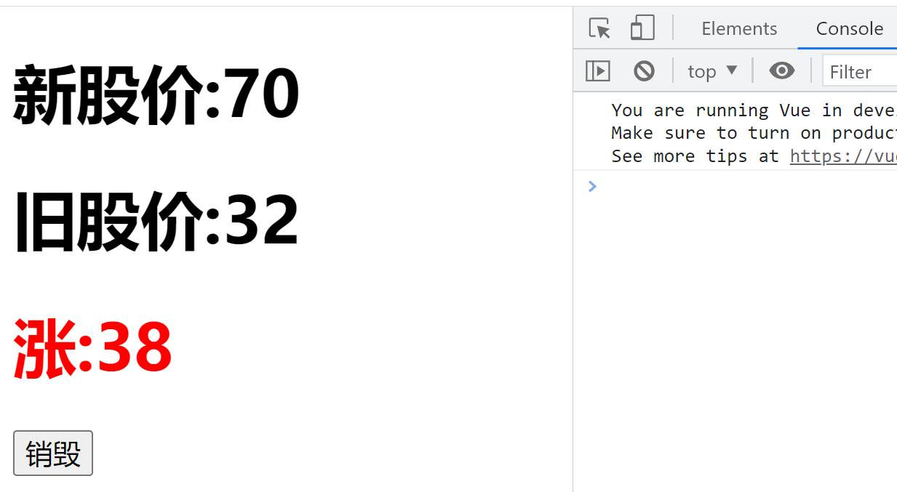

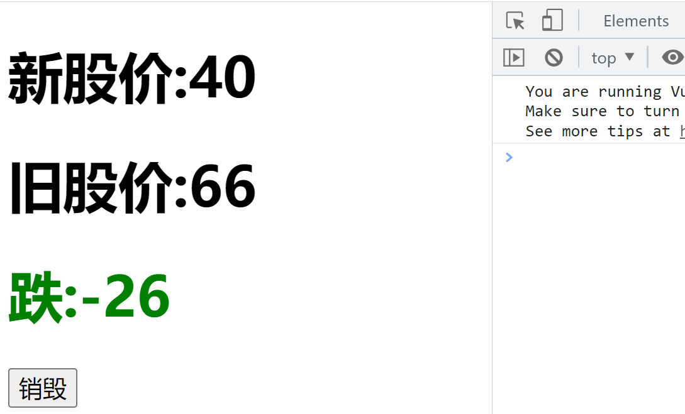

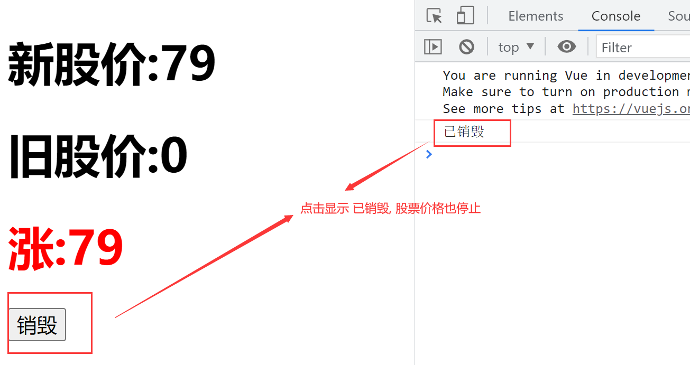

 

#### 3. 实验源码

[Vue2](./Vue2/ep11.html)  | [Vue3](./Vue3/ep11/)

------

## 六、单文件组件

### （一）单文件组件

#### 1. 实验目的与要求

（1）掌握Vue 脚手架的用法

（2）掌握Vue 项目的创建

（3）掌握Vue 单文件组件的使用

（4）掌握Vue 的生命周期

#### 2. 实验题目

设计一个父组件app和子组件myPeople。

要求：

（1）父组件app拥有2个子组件myPeople，父组件app传递数据给2个子组件myPeople，让他们分别显示教师和学生的数量。且1个教师对应10个学生.

（2）子组件myPeople有slot插槽。父组件决定显示教师的子组件插槽为按钮标签，显示学生的子组件插槽为广科大学生图片。图片地址为：https://www.gkd.edu.cn/upload/images/2022/3/189e568bed4b5bdf.jpg 。

不同：

（1）项目必须为**单文件组件**。

（2）显示教师的子组件有一个按钮用来开关定时器。例如：点一下运行，再点一次关闭。当定时器打开时，教师的数量每一秒加1，学生的数量每一秒加10。

效果如下：

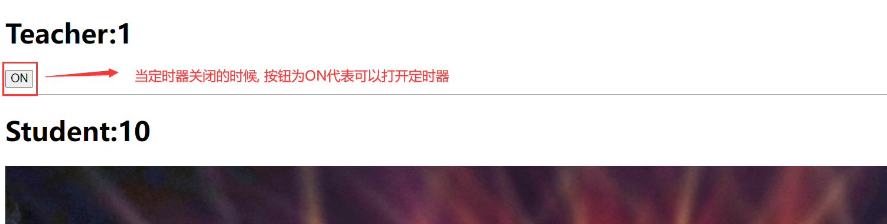

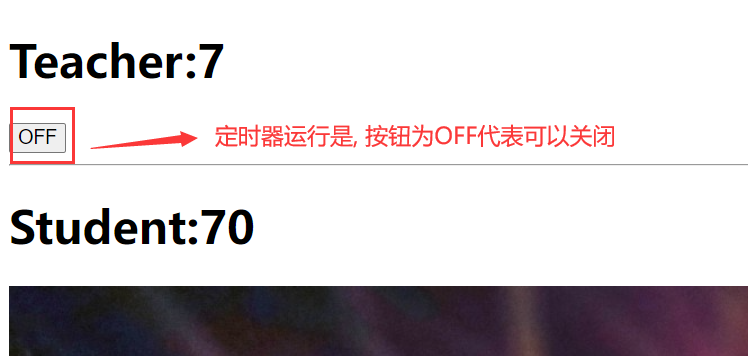

#### 3. 实验源码

[Vue2](./Vue2/ep12/)  |  [Vue3](./Vue3/ep12/)